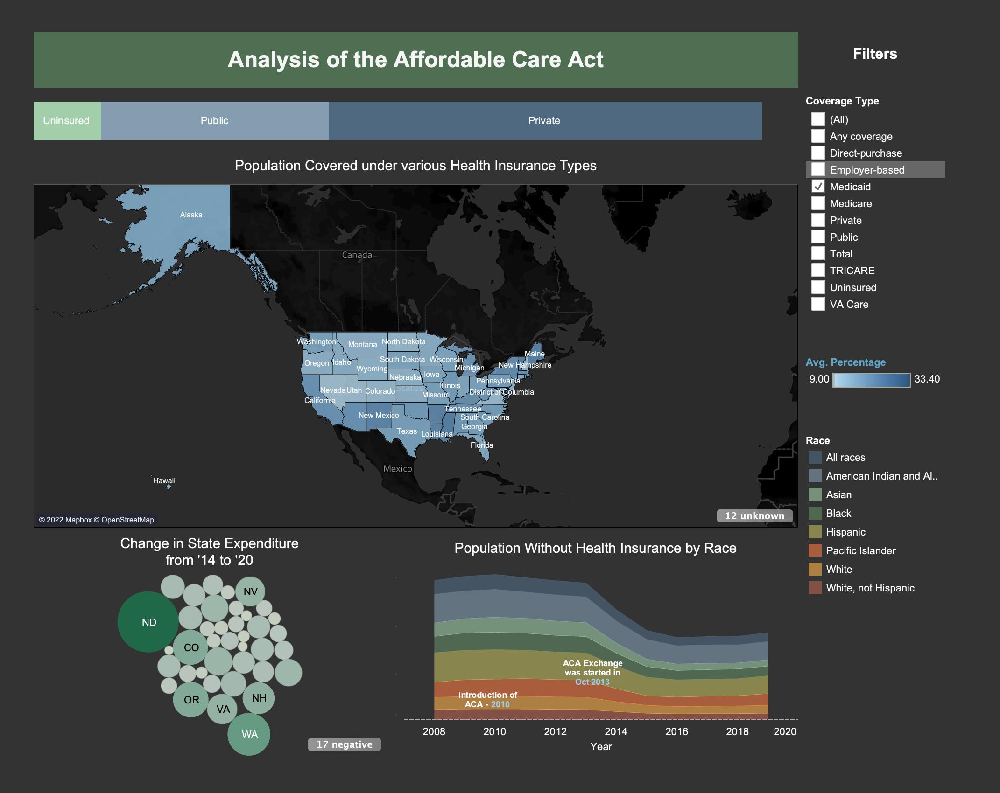

# Affordable-Care-Act-Analysis

## Analyzing the impact of the policy, Affordable Care Act, introduced by US Congress in 2010

United States happens to be one of the only few developed nations, where healthcare is almost unaffordable for a large section of its population. Before 2010, US spent over 18% of its GDP on health, whereas countries like Germany and Australia spent only between 9-11%.

To tackle this issue, President Obama’s administration had launched the health reform – the Affordable Care Act (ACA is popularly known as Obamacare) in 2010, which expanded Medicaid eligibility to larger parts of the uninsured population. The ACA has improved health coverage for people of color significantly. Despite this, it is said to have many cons and less than 50% of the population wholly supports the Act. 

Goal: To visualize the pros and cons of the Affordable Care Act 2010, and to understand the pain points of Act which can be improved

Data: The starting point for data collection can include the following links

https://data.world/gswider/aca-state-data (Links to an external site.)

https://www.census.gov/content/dam/Census/library/publications/2020/demo/p60-271.pdf

## Names of students involved
* Emma Carlson
* Nathan Grant
* Eli Corpron
* Reeya Pimple

###   Project name: Analyzing the Impact of the Affordable Care Act

### Final Dashboard

###  Concept:  Show the effects and effectiveness of ACA

## Goals:
* Show changes in premiums and coverage under/after ACA 
* Visualize the shift in minority groups being covered under health insurance (i.e. who stands to benefit)
* Analyze the impact of creation of insurance exchanges in different States in US 
* Try and find reasons, or correlated trends with coverage and premium raises (eg. does a state being Republican or Democrat have any correlation)
* A description of the intended users and tasks. Remember to talk to REAL POTENTIAL USERS and include any data gathered from this research in your proposal. Proposed user personas and scenarios may be helpful here.

## Intended Tasks: 
* Identifying coverage gaps that have been amended and coverage gaps that persist despite the implementation of this act 
* Show tangible differences in coverage and premiums, instead of relying on anecdotal evidence

## Intended Users: 
* People interested in healthcare coverage, but don’t necessarily have extensive knowledge of it
* Healthcare billing employees concerned comparing with Medicaid coverage in their hospital to coverage in their state or coverage nationwide
